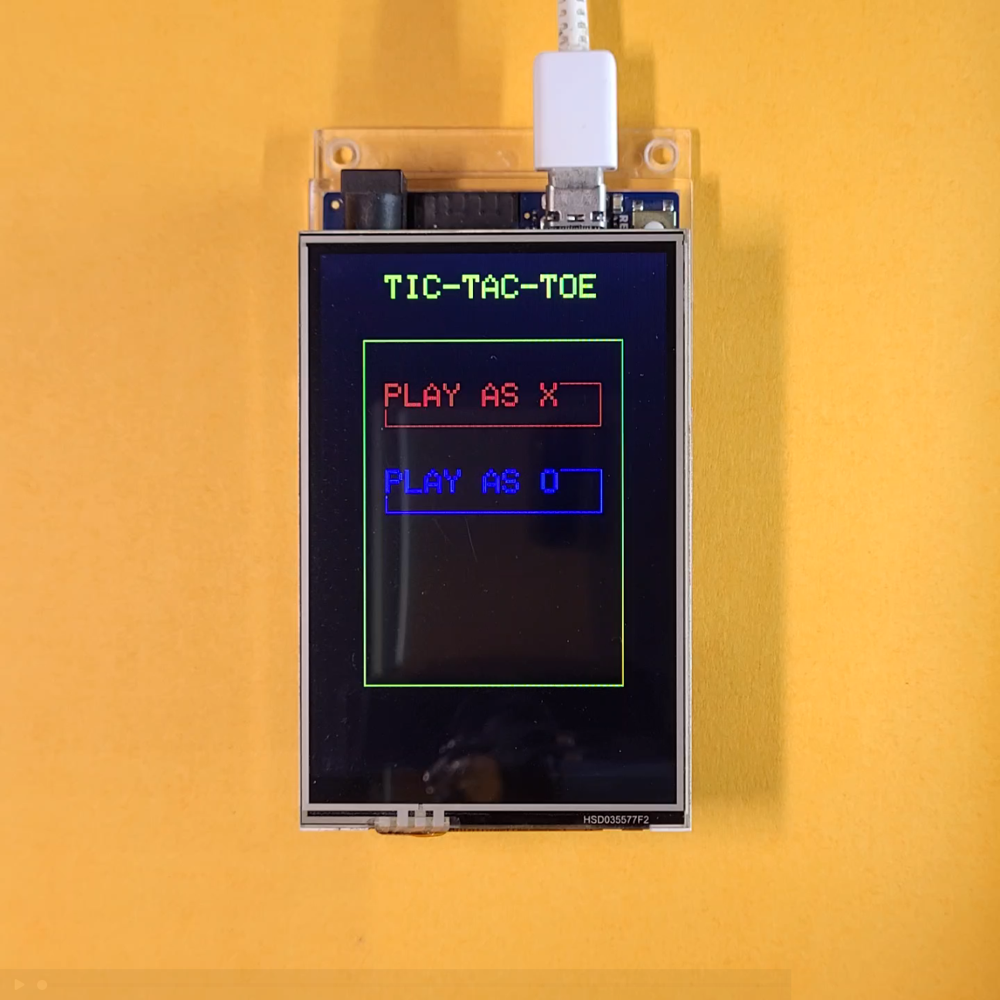
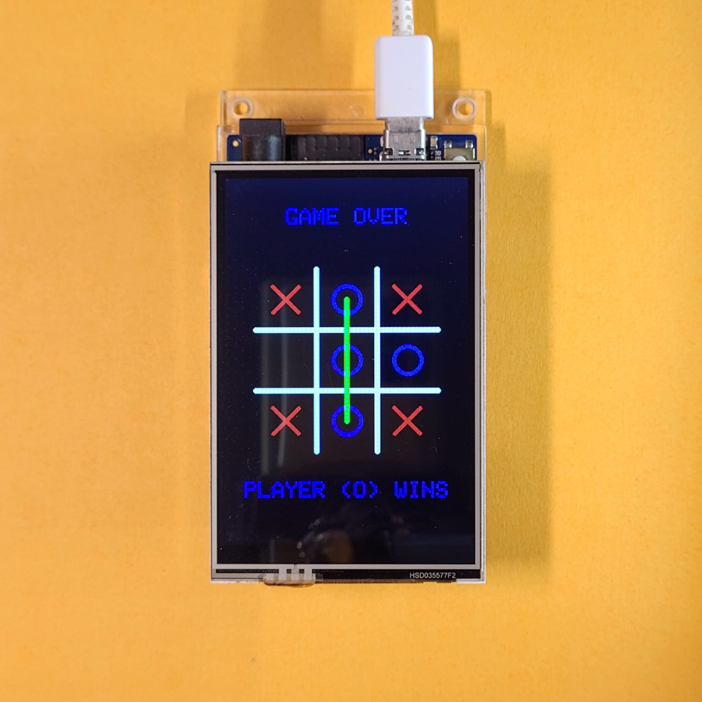
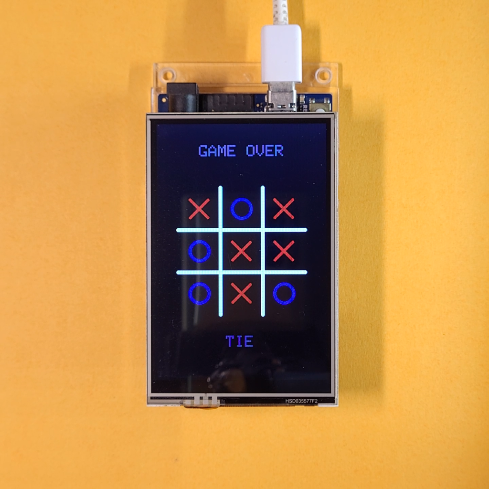

# TicTacToe On a 3.5" TFT LCD Touchscreen With Arduino UNO R3/R4


## Overview

This repository contains a program to play TicTacToe on a 3.5" touch screen display shield, as shown below -

|||
|-|-|

Most 3.5" TFT LCD Touch displays use the ILI9486 Display Driver and include a resistive touchscreen. **The PCB Layout & silkscreen text may vary slightly between displays. This does not change their behaviour and functionality.** This repository depends on the following libraries -

- [Adafruit Touch Screen Library](https://github.com/adafruit/Adafruit_TouchScreen) to manage touch input
- [Adafruit GFX Library](https://github.com/adafruit/Adafruit-GFX-Library/tree/master) for graphics primitives
- [This fork of the MCUFriend KBV library](https://github.com/slviajero/MCUFRIEND_kbv) to drive the display (this makes it compatible with the UNO R4)

The program has been written using PlatformIO, and has been tested on the [Arduino UNO R3](https://docs.arduino.cc/hardware/uno-rev3/), [Arduino UNO R4 Minima](https://docs.arduino.cc/hardware/uno-r4-minima/) & [Arduino UNO R4 WiFi](https://docs.arduino.cc/hardware/uno-r4-wifi/).

> [!TIP]
> A detailed tutorial on how to use this repository is available at https://dumblebots.com/2024/08/05/using-3-5-tft-lcd-display-ili9486-arduino-part-6-tictactoe-game/. The tutorial includes a comprehensive explanation of the code and how to use it.

## Building/Uploading With PlatformIO

Since this project has been written using PlatformIO by default, simply run the following commands to fetch the libraries, build the project and upload the program -

```shell
pio pkg install
pio run
pio run --target upload
```

## Building/Uploading With Arduino IDE

Create a new sketch and copy the contents of [```src/main.cpp```](/src/main.cpp) from this repository into the default ```.ino``` file. Create a new tab/file in the IDE named ```constants.h``` and copy the contents of [```src/constants.h```](/src/constants.h) from this repository into this file.

Install the Adafruit Touch Screen Library and Adafruit GFX Library from the Library Manager (under *Sketch>Include Library>Manage Libraries...*)

Download [this](https://github.com/slviajero/MCUFRIEND_kbv) repository as a ZIP file and install it by navigating to *Sketch>Include Library>Add .ZIP Library*, and selecting the downloaded file from the file explorer.

After this, you can Build and Upload the program as usual.

## Calibrating the Touchscreen

Run the program given in [this](https://github.com/Aditya-A-garwal/Arduino-TFT-LCD-3-5-Touch-Calibration) repository to calibrate the display. The display should print the values of 4 constants to the Serial Monitor. Copy and paste these values in [```src/constants.h```](/src/constants.h) to calibrate the touchscreen.

## Using the Example

As soon as the program is uploaded, the display should turn black and a menu should appear, prompting the player to select between X and O.

||
|:-:|
|Starting Menu|

After an option is selected, the game begins. X moves first, followed by O, with the process repeating till a tie occurs or one of the players wins.

When a game is over, a line is drawn over the winning 3 pieces, followed by a game-over screen that announces the winner.

||||
|:-:|:-:|:-:|
|X wins|O wins|Draw|

For now, the moves chosen by the Arduino (opponent) are randomized, i.e. it will not follow a winning strategy. This means that if a player has a winning move that can be blocked by the Arduino, it may not necessarily pick that move. This is expected behavior.
Additionally, the random number generator always begins with the same seed, i.e. two games where the player plays the same moves will always end the same.

## Troubleshooting

Some common problems and their solutions -

|Problem|Solution|
|-|-|
|Display stays white after uploading program|Non-Standard Driver (not ILI9486)|
|Display not responding after touch|Try changing the order of the touch pins in [```src/constants.h```](/src/constants.h) file, i.e. swap the values of ```XP```, ```YP```, ```XM``` and ```YM```|
|Touched point and display response not matching|Try calibrating the display using the instructions given [here](https://github.com/Aditya-A-garwal/Arduino-TFT-LCD-3-5-Touch-Calibration)|
|Compilation issues related to SPI|Update the Arduino IDE version and/or install the SPI library|
|Display Flickering/Arduino is reset automatically|Faulty Power Supply/Cable|
